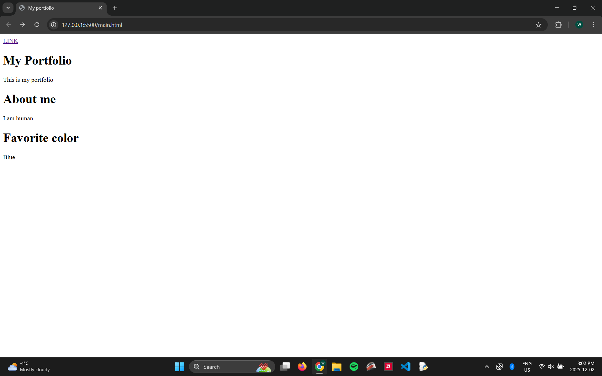

<html land="en">
    <head>
        <meta charset="UTF-8">
        <link rel="stylesheet" href="styles.css">
    </head>
    <body>
        <h1 style="font-size:80px;">My Website</h1>
        <h1>My Portfolio</h1>
        
This is my portfolio

        <h1>About me</h1>
        
I am human

        <h1>Work</h1>
        

            me working on this web or something
        

        
        

        <a style="font-family:'Courier New', Courier, monospace"  href="page.html">Current photo and video trends</a>
        <a style="font-family:'Courier New', Courier, monospace" href="assignment1.html">Assignment 1</a>
        

    </body>
</html>
